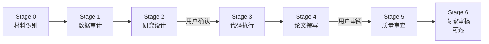
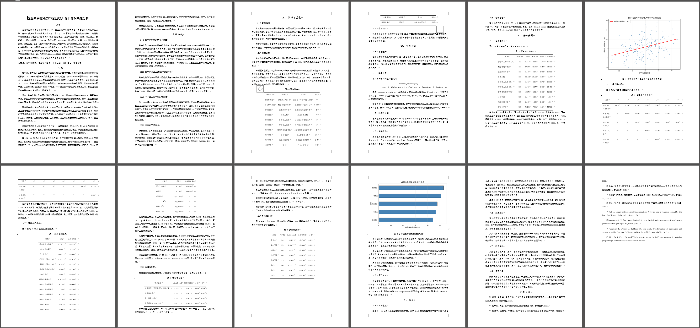

# empirical-paper

实证研究流程自动化 —— 面向经管类实证研究的 AI 辅助工作流。用户提供研究框架、参考文献与数据，工具自动完成数据审计、模型代码执行、结果表格生成和一致性验证，用户在关键节点确认后输出可审阅的论文草稿。

## 架构概览



| Stage | Agent | 职责 | 人工介入 |
|-------|-------|------|----------|
| 0 | 主 Agent | 识别材料，生成 manifest 和统一框架 | 无 |
| 1 | 数据审计 | 数据质量检查，变量映射 | 无 |
| 2 | 研究设计 | 模型选择、公式推导、变量定义 | **Blocking Gate**: 五项确认 |
| 3 | 编程手 | 跑代码，生成表格和图 | 方法降级时暂停 |
| 4 | 论文手 | 撰写全文，含政策搜索 | **Blocking Gate**: 审阅初稿，最多 2 轮修改 |
| 5 | 审查手 | 6 维度质量审查 + 一致性验证 | 无 |
| 6 | 独立审稿人 | 专家视角审稿 + AI 味评分（可选） | 无 |

## 关键设计决策

**1. 人工卡点而非全自动**

Stage 2 和 Stage 4 设置了 Blocking Gate，通过 `AskUserQuestion` 强制等待用户确认。实证研究涉及方法选择、变量定义等需要领域判断的决策，全自动容易产生不可逆错误。用户确认后写入 `user_confirmed.flag`，后续 Stage 会校验此文件。

**2. Markdown 中间格式 + pandoc 转换**

管线为 `Markdown → pandoc → raw.docx → python-docx 后处理 → paper_final.docx`。选择 Markdown 而非直接生成 Word，是因为 Markdown 能稳定承载 LaTeX 公式，pandoc 负责将公式转为 Word 原生格式，python-docx 只做样式后处理（标题层级、三线表、字体、引用上标）。这样各环节职责清晰，出错可定位。

**3. 程序化反幻觉验证**

不信任 LLM 自查。`verify_consistency.py` 和 `validate_docx.py` 两个脚本独立验证：论文中的数字是否与代码输出一致、引用编号是否完整、图表是否全部嵌入、公式是否被破坏。验证发现 BLOCKER 级问题时，最终论文不得标记为通过。

**4. 会话状态驱动的断点续接**

`session_state.md` 记录当前流水线阶段和检查点。上下文压缩或对话中断后，`stage_guard.py --infer` 自动推断当前阶段并检查前置条件，无需从头重跑。

## 示例输出



## 快速开始

### 安装

```bash
mkdir -p .claude/skills
git clone https://github.com/megg-ops/empirical-paper.git .claude/skills/empirical-paper
```

安装 Python 依赖：

```bash
# pip
pip install -r .claude/skills/empirical-paper/scripts/requirements.txt

# uv
cd .claude/skills/empirical-paper && uv sync
```

还需要 [pandoc](https://pandoc.org/installing.html)：

```bash
pandoc --version
```

### 准备材料

```
你的项目/
├── 研究框架.docx        # 或 .md 或 .pdf（必须）
├── 建模数据.xlsx        # 或 .csv（必须）
├── 论文模板.docx        # （可选）
└── references/           # 参考文献目录（可选）
    ├── ref1.pdf
    └── ref2.pdf
```

### 运行

在 Claude Code 对话中输入 `/empirical-paper`，根据当前路径下文件，启动实证论文自动化撰写工作流，输出 docx 格式文件，或直接在对话中问 `/empirical-paper` 这个 skill 怎么用。

工具会自动完成 7 个 Stage，在 Stage 2 和 Stage 4 暂停等你确认，最终输出到 `paper_workspace/final_paper/`。

### 推荐文件命名

```
研究框架.docx / research_framework.docx / 研究框架.md
建模数据.xlsx / data.xlsx / 数据.xlsx
references/ / refs/ / 文献/
```

## 研究框架格式

研究框架是告诉工具"写什么、怎么写"的文档。支持 `.docx`、`.md`、`.pdf`。

### 必须包含的内容

| 内容 | 说明 |
|------|------|
| 论文标题 | 一句话 |
| 目标字数 | 总字数 |
| 章节安排 | 每章标题、字数、子节 |
| 子节写作指引 | 每个子节写什么 |
| 公式标记 | 哪些子节需要公式推导（写"公式""推导""模型"等关键词） |
| 表格/图标记 | 哪些子节需要表格或图（写"表格""描述性统计""回归结果"等关键词） |
| 参考文献要求 | 必引文献、数量、比例 |
| 变量说明 | 变量名、含义、来源 |

### Markdown 格式示例

```markdown
# 数字化转型对企业绩效的影响研究——基于A股上市公司面板数据

目标字数：8000字

## 摘要（300字）
包含：研究问题、方法、主要发现、政策含义
关键词：数字化转型 / 企业绩效 / 固定效应 / 面板数据 / 异质性分析

## 一、引言（1000字）
### （一）研究背景
数字经济背景下企业数字化转型的战略意义

### （二）文献综述
数字化转型的测度方法、绩效影响的实证发现、现有研究的不足

## 二、研究设计（1500字）
### （一）模型设定
【公式】双向固定效应模型推导，变量定义，经济含义

### （二）变量说明
【表格】被解释变量（ROA/ROE）、核心解释变量（数字化转型指数）、控制变量

## 三、实证分析（3000字）
### （一）描述性统计
【表格】各变量均值/标准差/最大最小值

### （二）基准回归
【表格】数字化转型对企业绩效的影响

## 参考文献
25-30篇，中英各半
```

## 模型选择规则

根据数据结构自动选择：

| 数据情况 | 推荐模型 |
|----------|----------|
| 只有截面数据 | 描述统计 + 相关分析 + OLS |
| 有年份和个体 ID | 双向固定效应优先 |
| 因变量为 0/1 | Logit/Probit |
| 因变量受限 | Tobit |
| 效率评价 | DEA/SFA |
| 政策冲击 + 处理组 | DID |
| 数据不支持 | 降级到可接受的分析 |

## 局限与适用范围

**适合：**
- 期末课程论文、本科/硕士课程作业
- 已有数据和大致研究主题的实证论文

**不适合：**
- 需要投稿发表的高强度论文
- 没有任何数据的论文
- 需要复杂因果识别但数据不支持的研究

## 常见问题

**Q: 没有 LaTeX 模板怎么办？**
skill 会生成默认模板（ctexart 文档类，A4 纸，标准页边距）。

**Q: 没有参考文献怎么办？**
论文手会尝试搜索补充，但建议至少提供几篇核心文献。补充的文献会标记为"待确认"。

**Q: 数据审计发现变量不匹配怎么办？**
skill 会列出未匹配的变量，询问你是否继续。

**Q: 编程手跑的代码报错了怎么办？**
skill 会自动分析错误并重试一次。你也可以手动检查 `paper_workspace/03_coder/output/analysis.py`。

**Q: 想修改某个章节怎么办？**
在 Stage 4 审阅初稿时提出修改意见，论文手会增量修改。最多 2 轮修改循环。

**Q: 想让某个阶段重做怎么办？**
删除对应阶段的 `output/` 目录内容（包括 `user_confirmed.flag`），然后重新启用 skill。

## 工作目录结构

```
paper_workspace/
└── your_project_20260605_120000_a1b2c3/  ← run_id 隔离
    ├── 00_intake/            # 材料识别 → manifest.json
    ├── 01_audit/             # 数据审计 → data_audit.md + variable_map.json
    ├── 02_modeler/           # 研究设计 → model_plan.md + 实证设计.md
    ├── 03_coder/             # 代码执行 → analysis.py + tables/ + figures/
    ├── 04_writer/            # 论文撰写 → paper_draft.md
    ├── final_paper/          # 最终输出 → paper_final.docx
    └── 06_expert_review/     # 专家审稿（可选）
```

## Word 输出管线

```
paper_draft.md → pandoc → raw.docx → python-docx 后处理 → paper_final.docx
```

- Markdown 承载 LaTeX 公式
- pandoc 将公式转为 Word 原生格式
- python-docx 只做样式后处理（标题、三线表、字体、引用上标）
- validate_docx.py 检查可打开性、公式、图表、引用和格式

## 文件结构

```
empirical-paper/
├── SKILL.md                           # 主协调者
├── README.md
├── pyproject.toml                     # 项目元数据、依赖、pytest 配置
├── demo.png                           # 示例输出截图
├── agents/                            # 6 个 Agent 定义
├── scripts/
│   ├── utils.py                       # 共享工具函数
│   ├── docx_gen/                      # Word 生成模块（styles/tables/assets/formulas/output）
│   ├── tests/                         # 单元测试（24 tests）
│   ├── gen_docx.py                    # Markdown → Word 入口
│   ├── validate_docx.py               # Word 验证
│   ├── verify_consistency.py          # 一致性验证
│   ├── check_word_count.py            # 字数统计
│   └── ...                            # 其他脚本
└── references/                        # 规范文档（写作、引用、格式、审查等）
```

## 免责声明

本项目用于生成可审阅的实证论文草稿、分析代码与质量检查报告。使用者需自行核验数据、方法、引用和最终文本，并遵守所在机构的学术诚信要求。
